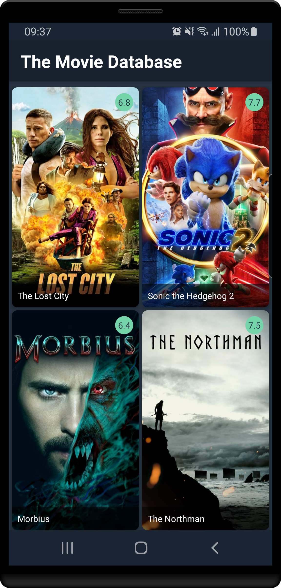
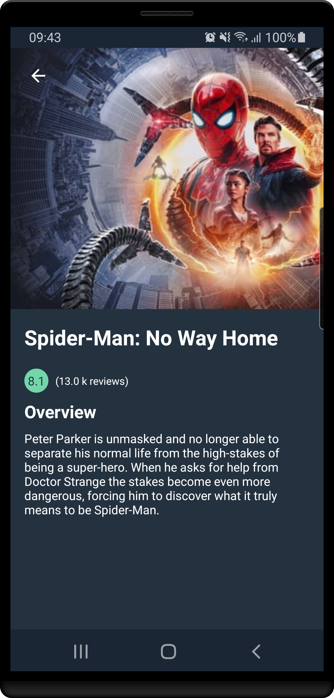

# The Movie Database

A simple app written using Kotlin and MVVM design pattern. The app shows infinite list of popular movies and their details retrieved from TMDb API.

## Libraries

- Coroutines and Flows
- Jetpack Compose
- Dagger 2
- Coil
- MockK
- Paging 3
- Retrofit
- Room

## Testing

The project contains  [Local unit tests][1] and [Instrumented tests][2].

Just run `./gradlew test` or `./gradlew connectedAndroidTest`

## Screenshots

 

[1]: app/src/test/java/com/example/themoviedatabase/
[2]: app/src/androidTest/java/com/example/themoviedatabase/
